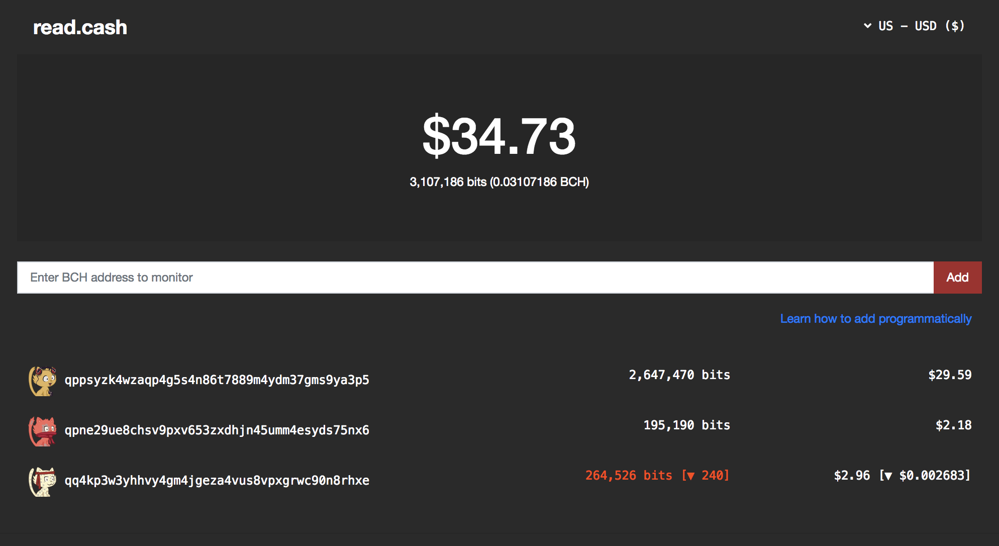

# Read.Cash

Manage multiple wallets from various Bitcoin applications, in one place, with zero risk.

## What

Read.Cash lets you manage multiple wallets from various applications (such as memo.cash, yours.org, blockpress, etc.) in a single place.

1. **Add**: Add wallets by public address instead of going through hassle of importing private keys.
2. **Watch**: Watch the dashboard to get a birds eye view of all the wallets you've added in a single place.
3. **Manage**: Effortlessly recharge all your application wallets using QR code and [Moneybutton](https://moneybutton.com)

## Why

We are on the verge of a cambrian explosion of "Bitcoin Apps". We already have several interesting apps running on top of Bitcoin Cash such as [memo.cash](https://memo.cash), [blockpress](https://www.blockpress.com), [yours.org](https://yours.org), [keyport](https://keyport.cash), etc. and we will see more and more apps launch in the near future. One notable thing about these apps is that **each app comes with its own embedded wallet**. This is great for user experience and also helps with reducing risk for users since each wallet is specific to its parent application.

However it's becoming hard to keep track of all the wallets across different apps, and I imagine it will become a nightmare to keep track of what is going on with our own money across different applications like these. This is where **read.cash** comes in.

1. By providing a dead simple interface for managing multiple wallets in a single place, read.cash provides a single unified interface to keep track of all your money across multiple apps.
2. By monitoring **public addresses instead of importing private keys**, read.cash ensures that nothing bad can ever happen, and you can feel free to add as many wallets as you want, with zero risk.

## How It Works

here are some highlights that make read.cash unique.

1. **Simple and Readonly**: It's for "Reading" from wallets. There's no private key management, no seed phrase, no complex stuff. Just add some public Bitcoin addresses from all your Bitcoin apps and you're set to go.
2. **Monitor changes**: Whenever you refresh the page, read.cash lets you know if there has been a new spend or a new incoming transaction making it easy for you to keep scores. 
3. **Zero Risk**: Read.cash doesn't import any private keys because all you add is public address. There is zero risk of losing money from read.cash, so add as many as you want.
4. **Monitor anything**: Since it works by adding public addresses, you can monitor any Bitcoin wallet--even those you don't own.
5. **100% Serverless**: The entire app is purely frontend based HTML. There is no backend that stores your data. In fact, you can even run it on your own local machine if you want. The source code is 100% open source and designed to be as transparent as possible.
6. **Charge your wallets effortlessly**: Read.cash implements a couple of powerful ways to charge your wallets, including QR Code and [Moneybutton](https://moneybutton.com), and more to be added. You no longer need to charge wallets from each app, you can do it all in one place.

## How to Use

### 1. Add Wallets

Try the app at [https://read.cash](https://read.cash). Some of the things you can try are:

1. Add your [memo.cash](https://memo.cash) wallet
2. Add your [blockpress](https://www.blockpress.com) wallet
3. Add your [yours.org](https://yours.org) wallet

As you start adding wallets, you'll see that the header displays the total sum of all the coins in your wallets.

### 2. Watch 

If you have acccounts in any of the above services, try making a transaction (such as posting a memo), and come back to read.cash and refresh, you'll see that your balance has gone down. Likewise, you'll see a green arrow when there's an incoming transaction (like a tip).

### 3. Charge your wallets

There are two ways to charge your wallets.

1. **QR Code**: If you already have a mobile phone wallet, you can scan the QR code to charge your wallets.
2. **Moneybutton**: If you have a [yours.org](https://yours.org) or [moneybutton](https://moneybutton.com) account, you can charge your wallets with an instant click. It's almost magical.
